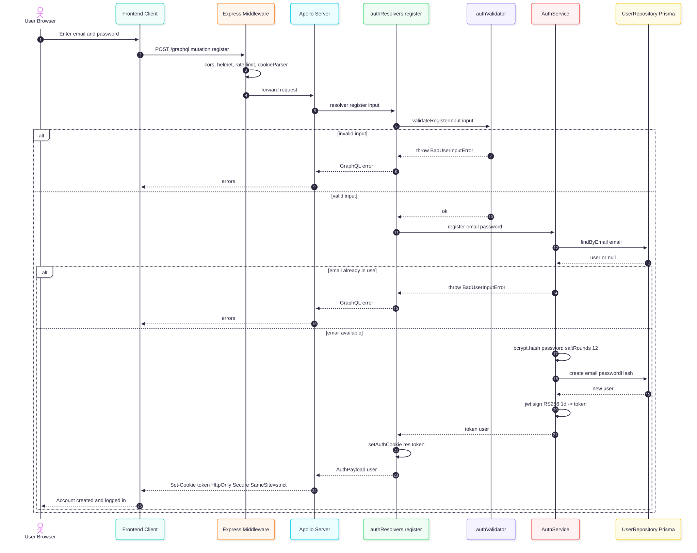
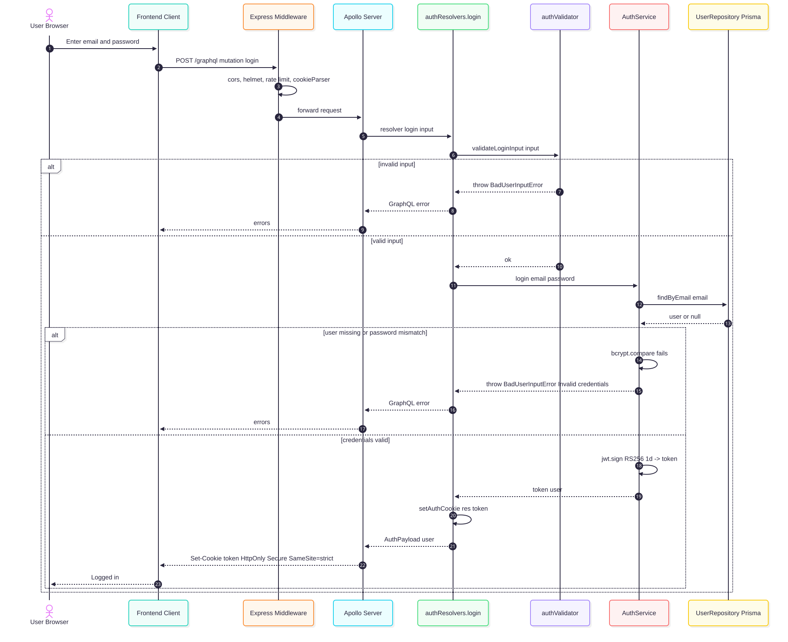
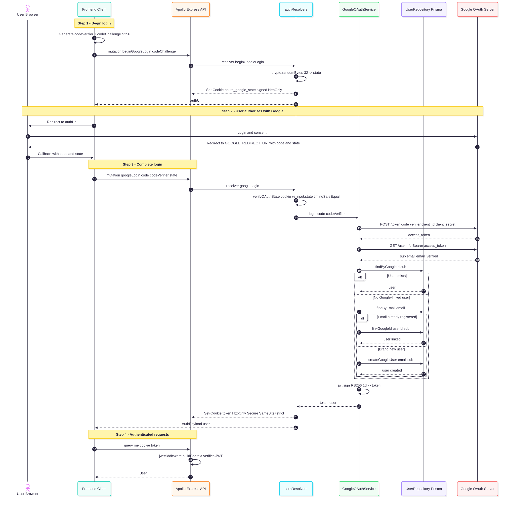
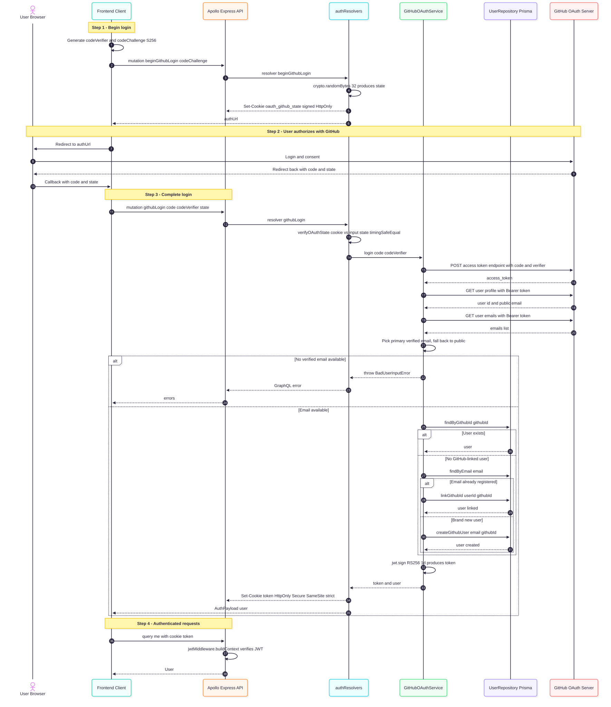
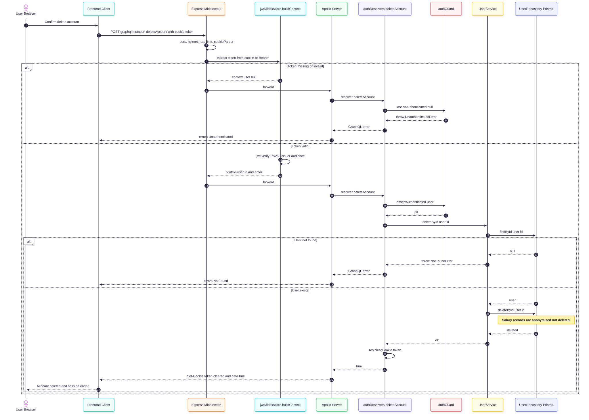

# auth/

Everything that handles who a user is and whether they are allowed to do something.

---

## Visual overview

Each authentication flow is documented as a sequence diagram below. They sit alongside the code so you can match the steps one-to-one.

### Register



### Login (email + password)



### Google OAuth 2.0 (PKCE)



### GitHub OAuth 2.0 (PKCE)



### Delete account



---

## AuthService.js

Handles registering and logging in users.

**Register:**

1. Checks that the email is not already taken (returns a vague error message to prevent user enumeration)
2. Hashes the password (never stores it in plain text)
3. Creates the user in the database
4. Strips sensitive fields with `#toPublicUser` before returning
5. Returns a signed token and the safe user object

**Login:**

1. Looks up the user by email
2. Compares the provided password against the stored hash
3. If it matches, strips sensitive fields with `#toPublicUser` and returns a signed token and the user
4. If it doesn't, throws an "Invalid credentials" error (same message whether the email or password is wrong, intentionally)

Input validation (email/password required, format, length) is handled by `authValidator.js` in the resolver layer before the service is called. AuthService does not duplicate those checks.

Tokens are signed with the private RSA key from `config/keys.js`, use the RS256 algorithm, expire after 24 hours, and include `issuer` and `audience` claims to scope them to this API.

---

## jwtMiddleware.js

Runs on every incoming request before anything else.

1. Checks the `Authorization` header first — if it starts with `Bearer `, extracts the token from there
2. If no Bearer header is present, falls back to reading the `token` cookie from the `Cookie` header
3. Verifies the token using the public RSA key (checks algorithm, issuer, and audience)
4. If valid, attaches `{ id, email }` to the request context so resolvers know who is making the request
5. If missing or invalid, sets `user: null` and continues without throwing

The two-path token extraction means the API works for both browser clients (which send the HttpOnly cookie automatically after login) and non-browser clients like Postman (which send `Authorization: Bearer <token>` manually).

Resolvers decide what to do with an unauthenticated request. This middleware never blocks a request on its own.

---

## authGuard.js

A single function — `assertAuthenticated(user)`.

Called at the top of any resolver that requires a logged-in user. If `user` is null, it throws an `UnauthenticatedError`. If the user is logged in, it does nothing and the resolver continues.

---

## GitHubOAuthService.js

Handles logging in (or registering) a user via GitHub OAuth 2.0 with PKCE.

1. Validates that the `state` parameter is non-empty (login-CSRF protection — the client must verify state before calling this)
2. Sends the authorization code and PKCE `code_verifier` to GitHub's token endpoint to exchange for an access token
3. Uses the access token to fetch the user's GitHub profile (id, login, email)
4. Looks up an existing user by their GitHub ID
5. If no match is found, checks whether an account with the same email already exists and links the GitHub ID to it; otherwise creates a new user
6. Issues an RS256 JWT (same format as password login) and returns it with the user object

OAuth users created through this flow have no password — the `passwordHash` field is null for their account.

---

## GoogleOAuthService.js

Handles logging in (or registering) a user via Google OAuth 2.0 with PKCE. Follows the same pattern as `GitHubOAuthService.js`.

1. Validates that the `state` parameter is non-empty (login-CSRF protection)
2. Sends the authorization code and PKCE `code_verifier` to Google's token endpoint (`https://oauth2.googleapis.com/token`)
3. Uses the returned access token to fetch the user's Google profile from `https://www.googleapis.com/oauth2/v3/userinfo`
4. Looks up an existing user by their Google ID
5. If no match is found, checks whether an account with the same email already exists and links the Google ID to it; otherwise creates a new user
6. Issues an RS256 JWT and returns it with the user object

---

## authResolvers.js

The GraphQL entry points for authentication.

- `register` — validates input, calls `AuthService.register`, sets a signed JWT as an HttpOnly cookie, returns the user object
- `login` — validates input, calls `AuthService.login`, sets the auth cookie, returns the user object
- `beginGoogleLogin` — step 1 of Google OAuth; accepts a PKCE `codeChallenge`, generates a random `state`, stores it in a signed HttpOnly `oauth_google_state` cookie (10-min TTL), returns the full Google authorization URL
- `googleLogin` — step 2 of Google OAuth; verifies the state cookie with `crypto.timingSafeEqual`, clears it, exchanges the code via `GoogleOAuthService`, sets the auth cookie
- `beginGithubLogin` — step 1 of GitHub OAuth; same pattern as `beginGoogleLogin`, uses `oauth_github_state`
- `githubLogin` — step 2 of GitHub OAuth; verifies state, exchanges via `GitHubOAuthService`, sets the auth cookie
- `logout` — clears the auth cookie server-side, returns `true`
- `deleteAccount` — requires login; calls `UserService.deleteById`, clears the auth cookie, returns `true`. Salary records remain in the dataset with `createdBy` set to `null`
- `me` — checks that the user is logged in, then returns their profile from `UserService`
- `User.githubConnected` — returns `true` if the user has a GitHub ID linked to their account
- `User.googleConnected` — returns `true` if the user has a Google ID linked to their account

The JWT is never returned in the response body — all auth mutations deliver it exclusively via cookie.

Input validation happens before the service layer is touched.

---

## Auth flow

```
Incoming request
  └── jwtMiddleware — reads token, sets context.user (or null)
        └── Resolver
              ├── mutations (create/update/delete) — assertAuthenticated(user) → blocks if not logged in
              └── queries (read) — no guard, public access
```

---

## GraphQL schema

The types and operations (`User`, `AuthPayload`, `BeginOAuthPayload`, `register`, `login`, `beginGoogleLogin`, `googleLogin`, `beginGithubLogin`, `githubLogin`, `logout`, `deleteAccount`, `me`) are defined in `src/graphql/schema/auth.graphql`.
