# graphql/

This folder wires the GraphQL layer together. It holds the schema definitions, the resolvers, and the file that assembles everything into a working Apollo Server.

---

## Component overview

> How the GraphQL layer sits inside the API container — middleware → JWT context → Apollo → resolvers → services → repositories → Prisma. Cross-cutting modules (validators, authGuard, errors, keys) sit beside the request path.

---

## setup.js

The composition root for the entire GraphQL layer. This is where all the pieces get connected.

It exports two things:

**`createServices()`**
Creates all repositories and services and returns them as a single object. Called once at startup in `server.js`. The result is attached to every request context so resolvers can call services directly.

**`buildApolloServer()`**
Builds and returns the Apollo Server instance. It:
1. Loads all `.graphql` schema files from `schema/`
2. Registers all resolver files
3. Applies a query depth limit of 7 levels to prevent deeply nested query abuse
4. Applies a total query complexity limit of 200 (default 1 per field) to prevent resource exhaustion
5. Configures the embedded sandbox (Apollo Studio in production, local sandbox in development)

---

## schema/

Type definitions for the entire API, one file per domain.

→ See [schema/README.md](schema/README.md)

---

## resolvers/

Resolver functions that handle incoming queries and mutations, one file per domain.

→ See [resolvers/README.md](resolvers/README.md)
